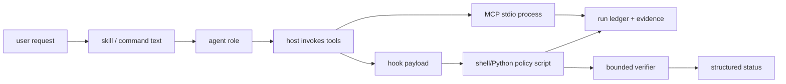

# Architecture tour

LazyQoder is not one runtime. It is a package of declarative host assets plus small local executables. The technical question at every boundary is: *who owns this file or process, and what observation can prove it ran?*

The arrows are not all automatic. Skills and commands are instructions that a host or agent may invoke; the host decides whether it loads them. Hook scripts receive host-provided structured input. MCP declarations merely tell a host how to start a local process. The package can validate every file in that path, but only a host observation proves loading or connection. On Qoder IDE, skills and commands load through the host plugin/extension flow, Agent-mode MCP bridges the local MCP servers, and RepoWiki/Quest/Expert teams provide the native surfaces the harness primitives augment.

## Package boundary

`lazyqoder-plugin/` is the distributable unit. It contains:

- `skills/`, `commands/`, and `agents/`: policy and role definitions;
- `hooks/` and `scripts/hooks/`: event mappings and input-policy adapters;
- `scripts/state/` and `scripts/loop/`: durable run/plan transitions;
- `mcp/`: narrow local JSON-RPC endpoints and their launchers;
- `tooling/`: local capability policy, receipt handling, and provider checks;
- `tests/`: package-boundary and hostile-input regressions.

The repository root holds public explanations and evaluation evidence. It is not required by the package at runtime. Conversely, marketplace installation, credentials, host configuration, and live sessions are host/user state, not package state.

## Follow one real path

Start in [07 — Package map](07-package-map.md). Then trace a workflow request through [04 — Workflow playbooks](04-workflow-playbooks.md), a persisted record through [07a — State and validation](07a-state-and-validation.md), and a protocol request through [07b — MCP lifecycle](07b-mcp-lifecycle.md). Finish with [09 — Test and release verification](09-test-and-release-verification.md) to see how the repository tests each boundary.
