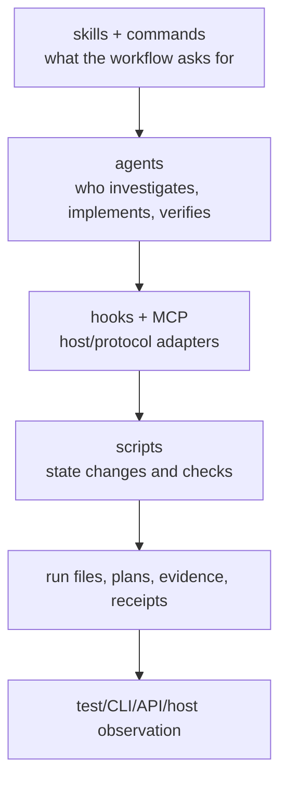

# Execution model

LazyQoder separates *policy*, *execution*, *durable state*, and *proof*. That separation prevents a descriptive Markdown file, an installed declaration, or a passing local check from being mistaken for a live host capability.

## Policy is not execution

Skills and commands describe how an agent should approach planning, debugging, review, or completion. Agent files narrow that guidance to a role. They do not gain authority merely by existing: a host must select and load them, and an agent must still perform the described work. On Qoder IDE, the host chooses whether to surface a skill as a slash command, an Expert-team role, or an Agent-mode subagent.

## Execution is not proof

The shell and Python scripts are the operational layer. They create run records, validate state, run bounded checks, and format machine-readable results. Their output establishes local package evidence. Proof must be chosen for the requested surface: a test for library behavior, a CLI invocation for a CLI, a browser check for a page, or an observed host session for an integration.

## Host ownership stays external

The package can check manifest structure, local declarations, executable bits, and protocol fixtures. It cannot prove plugin discovery, SessionStart, hook execution, marketplace activation, or a connected MCP session. Those are host facts. This distinction is central to [05 — Evidence and completion](05-evidence-and-completion.md).
