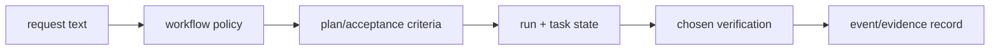

# Request decomposition

The workflow layer converts an open-ended request into three durable concepts: an outcome, acceptance criteria, and a proof surface. The package does not parse product intent automatically; skills and agents make these concepts explicit so later state and verification have something concrete to reference.

## Input shape

An effective workflow request has this conceptual shape:

```text
outcome: what changes for the user
constraints: scope, safety, compatibility, ownership limits
acceptance criteria: observable pass/fail conditions
proof surface: test, CLI, API, browser, or host session
```

`skills/qoder-ulw-plan/` teaches the planning role to preserve uncertainty as a decision rather than silently inventing it. It maps to Qoder IDE **Quest mode**, which auto-generates a technical design/spec for the stated goal. `skills/qoder-start-work/` assumes that a plan has already identified the acceptance criteria and runs inside Qoder IDE **Agent mode + Subagents**. This is why planning and execution are separate files and separate host actions.

## From request to records

The state helpers under `scripts/state/` provide the persistence layer for the workflow: a run contains tasks, checkpoints, events, and evidence references. The loop helpers operate on that state rather than trying to infer current work from the latest chat message. A verifier can therefore inspect the claimed outcome, named checks, and recorded result independently.

## Proof surface selection

The proof surface is intentionally not always a test suite. A library change may be proved by tests; a command requires a command invocation; a UI needs a visual/user interaction check; a host integration requires host observation. The workflow text only directs that selection. The executable verifier records package-local checks, while the person or host supplies the final surface observation.

See [Workflow playbooks](04-workflow-playbooks.md) for policy roles and [State and validation](07a-state-and-validation.md) for the persisted representation.

## Implementation handoff

The request text is interpreted by policy files first, then becomes state only when an execution path chooses to record it. `skills/qoder-ulw-plan/` defines the questions that must be answered before implementation; `skills/qoder-start-work/` expects an approved plan and directs evidence collection. The state scripts turn those ideas into `state.json`, `events.jsonl`, checkpoints, and evidence references.



Nothing in this flow infers success from the prompt itself. Each transition is an explicit script, host invocation, or recorded observation; that makes the result inspectable after the original conversation has ended.
