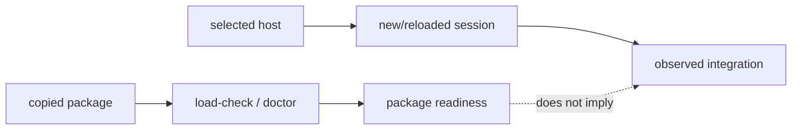

# Package delivery

This page explains the deployment boundary in code terms. A plugin package contains files a host may load; it does not contain the host's marketplace database, session state, or connector process table.

## Current v1.2.3 route status

This documentation boundary covers `qodercli-cli`, `qodercli-ide`, and
`qoder`; it does not publish a v1.2.3 package. Marketplace is the default
full-plugin route for Qoder CLI IDE and Qoder IDE. The Skills/manual-MCP route
is recovery-only and mutually exclusive with a full-plugin route. v2 records
native mode as `invoke-documented`, `observe-only`, `descriptor-only`, or
`unavailable`; public label as `documented-tested`, `documented-untested`,
`observed-build-specific`, or `unavailable`; and evidence scope as `package`,
`probe`, or `current-session`. Package readiness does not prove a live host.

Automatic workflow selection uses task risk and complexity to select the
smallest sufficient existing workflow. Before a fresh host observation, this is
only a selection record; it does not prove a workflow loaded or dispatched.

## Durable lifecycle

Prerequisites are **Node.js LTS 20 or newer** and **Git**. Bootstrap `onboard`
only from `https://github.com/elvinzhao10/LazyQoder.git`. After promotion use
`node "<install-root>/LazyQoder/launcher.js"` for `update`, `status`, and
plan-first `offboard`. The exact tree is
`LazyQoder/{active.json,launcher.js,releases/,receipts/,rollback/,staging/,locks/}`;
the bootstrap checkout may be deleted.

Default install roots are `~/Library/Application Support/LazySeries` on macOS,
`${XDG_DATA_HOME:-~/.local/share}/lazyseries` on Linux, and
`%LOCALAPPDATA%\LazySeries` on Windows. A moved same-version ref requires
`--confirm-revision <full-sha>`. A stale Node runtime requires scoped
offboard/re-onboard, not receipt edits. Platform paths are package behavior,
not host proof: **HOST READINESS: PENDING** until current observation.

## Host onboarding

Open or link the durable release selected by `status` in the selected host, give the agent
`https://github.com/elvinzhao10/LazyQoder`, and type `onboard`. The agent asks
which host is in use, runs safe package checks, and reports package readiness
separately from host readiness. Before a host-managed marketplace, plugin,
Skills, or connector change it asks for approval, then gives one exact action
and waits. After the response it inspects the host with Computer Use; any
reload/new-session step is separate. Qoder IDE's supported fallback is Skills
import plus six individual manual local MCP connectors. Files or load-check
output never imply Qoder IDE commands, agents, hooks, or MCP loaded without a
real full-plugin session. Host proof must show one real Skill/command and every
expected MCP connection. If Computer Use is unavailable, a user-pasted verbatim
status or screenshot is observed evidence; otherwise **HOST READINESS:
PENDING**.

Route status is explicit: the local marketplace is the **documented Qoder CLI
CLI route and the preferred Qoder CLI IDE route whenever the Qoder CLI CLI is
available**. Qoder IDE uses `.qoder-plugin/plugin.json` as its default
marketplace full-plugin route. The `manual-skills-mcp-fallback` is recovery
only. Package checks never upgrade any route to host proof.

## Copyable versus observed state

`lazyqoder-plugin/` can be copied and checked in isolation. `scripts/lazyqoder-load-check.sh` inspects the selected package root, manifests, inventories, declarations, executable scripts, and tooling contract. `lazyqoder-plugin-doctor.sh` adds health diagnostics. Neither script asks a host to install a plugin or open an MCP connection.

The host is a second runtime. Qoder CLI and Qoder IDE choose how plugins are discovered, when hooks receive events, and when MCP launchers are spawned. The package models that with declarations and tests; it deliberately does not scan or mutate host-owned paths to infer success.

## Two evidence channels



The first channel supports claims about package contents. The second supports claims about host loading. Keeping the channels separate is what lets uninstall be safe: package removal cannot guess where a host stored marketplace or connector data.

## Delivery surfaces

Qoder CLI CLI uses these documented terminal commands against the absolute
active durable release root printed by `status --route
qodercli-marketplace` (not a source checkout or nested `lazyqoder-plugin/`):

```text
qodercli plugin marketplace add "<active-durable-release-root>"
qodercli plugin install lazyqoder@lazyqoder
```

Inside a Qoder CLI session, the interactive `/plugin` menu is equivalent; do
not use the slash forms as terminal commands. Qoder CLI IDE uses that same
user-scope CLI marketplace route whenever the CLI is available; its supplied
GUI Add local directory flow failed. If the CLI is unavailable, use the public
Skills import plus manual MCP JSON fallback. Qoder IDE uses the active
release's `.qoder-plugin/plugin.json` marketplace source. The recovery-only
fallback remains Skills-only import plus six manual connectors and excludes commands, agents, and
hooks. Full plugin/manual coexistence is unsupported: stop the session, remove
only old LazyQoder entries through the host UI, choose one route, start a new
session, and verify it.

For Qoder CLI IDE, the GUI full-plugin sequence is an observed-build
alternative only: add the release root as a local directory marketplace, wait
for discovery, install as a separate action, fully restart, then verify a fresh
session. The supplied GUI flow failed, so prefer the CLI route and retain
**HOST READINESS: PENDING** until observed.

### Qoder IDE marketplace full-plugin boundary

The nested `.qoder-plugin/plugin.json` remains the default marketplace
source even without a public manifest schema. Never inspect or mutate private
Qoder IDE registries. This package preflight remains read-only:

```bash
bash lazyqoder-plugin/scripts/lazyqoder-qoder-preparation-check.sh \
  --project-dir "<absolute-project-root>"
```

It prints `HOST_PREPARATION=not-applied`, `HOST_MUTATION=none`, and
`HOST_READINESS=pending`; `--apply` refuses. Treat supplied QA as historical
observed behavior, never as permission to reproduce undocumented host state.

The supplied 2026-07-18 macOS reports inspected Qoder IDE v5.2.6 on macOS; the
Qoder CLI exact host version/build was not recorded, and an unsupported build
remains **HOST READINESS: PENDING**. The fallback's exact
non-mutating six-entry JSON—with absolute release-local `server.sh` arguments,
`cwd`, `CWD`, and `CODEBUDDY_PROJECT_DIR` set to the consumer project—is in
[Host routes](reference/host-routes.md#manual-connector-specification).

`.qodercli/settings.json` is shareable non-secret project scope; ignored
`.qodercli/settings.local.json` is local/machine scope, and secrets must never
be committed. `--plugin-dir` is development/testing only, never persistent.
The detailed host adapters are in [Host capability matrix](10-host-capability-matrix.md)
and [Host routes](reference/host-routes.md).
