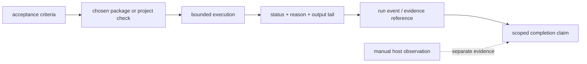

# Evidence and completion

Completion is a claim backed by evidence, not a green-looking status message.
LazyQoder separates package readiness from live-host behavior; that distinction
is the most important rule for interpreting results.

## Two kinds of evidence

| Evidence | What it can establish | What it cannot establish |
| --- | --- | --- |
| Package checks | Copied assets, declarations, inventories, contracts, and local scripts are present and valid. | That Qoder IDE loaded the plugin, ran a hook, or connected MCP. |
| Host observation | A host UI or new session shows the skill/command and required MCP connection. | That every package check or workflow requirement passed. |

Run these from `lazyqoder-plugin/` when applicable:

```bash
bash scripts/lazyqoder-load-check.sh
bash scripts/lazyqoder-plugin-doctor.sh
bash scripts/lazyqoder-mcp-test.sh
bash scripts/lazyqoder-verify.sh
```

The expected package evidence is respectively `PACKAGE_READINESS=full` (or an
explained degraded state), `Doctor check: ALL PASS`, `MCP test: ALL PASS`, and
aggregate JSON containing `"all_pass":true`. The aggregate JSON also records a
bounded per-check status/reason; a timeout is failure, not proof of success.
The release-only publication contract is checked with `bash tests/publication-regression.sh`.

Timeout cleanup is best-effort for trusted package-owned checks: the verifier
terminates the check's dedicated process group and records whether descendants
were still detectable. It is not a security sandbox or a guarantee that every
descendant has stopped. Use a VM or container-backed runner for
genuinely untrusted commands; no no-fork sandbox is enabled by default.

## Read the result at the right scope

Package readiness, doctor, MCP test, and capability status are read-only
package evidence. They do not install a global integration, activate an
optional provider, export a host registration, or prove a running session.
The six local endpoints have JSON-RPC stream regression coverage, including
malformed-input recovery; that is endpoint protocol evidence, not a host
connection claim.

For Qoder IDE, confirm a LazyQoder skill/command and MCP status in a new
session after using the host plugin/extension flow. The eight local MCP servers
(`run-ledger`, `verification`, `status-dashboard`, `context-graph`, `code-intel`,
`docs`, `codegraph`, `lsp`) should appear as connected under Agent-mode MCP
settings. On the local fallback, confirm imported skills and manually configured
connectors. Full routes are in [host routes](reference/host-routes.md).

## Evidence during work

A reliable done claim names the requested outcome, changed files, exact
commands and results, real-surface/manual-QA observation where needed, cleanup
performed, and any remaining risk. A verifier should independently reproduce
the claimed checks and classify each outcome as pass, failure, warning,
not-applicable, or skipped with a reason.

`qoder-ulw-loop` turns open-ended work into goals with explicit success
criteria. `qoder-start-work` coordinates plan execution, evidence, verification,
and review inside Qoder IDE Agent mode + Subagents. `qoder-review-work` passes only
when all five lanes pass. These are workflow gates; they do not erase the
host-boundary requirement above.

## Scope and limits

Current verification scope is macOS. Normal CI does not require a sibling
repository. A release-only paired parity check may receive explicitly supplied
sibling roots for comparison, but that is neither a runtime nor installation
dependency. Do not describe a copied repository as a verified Qoder IDE plugin
installer.

For check meanings, expected output, and exclusions, use the
[verification contract](reference/verification-contract.md). For all five
evidence layers, use [test and release verification](09-test-and-release-verification.md). For workflow selection, return to [workflow playbooks](04-workflow-playbooks.md).

## Evidence data flow

Evidence is not a single boolean. The package carries several facts from a
check into the final report:



`lazyqoder-verify.sh` constructs the aggregate status from individual result
files rather than parsing prose. State scripts preserve a run event/evidence
reference separately from verifier output. This lets a reviewer distinguish
“the package check passed,” “the requested surface was observed,” and “the
claim remains limited by an unverified host fact.”


## v1.3.2 measurement boundary

Cost-outcome records may identify `measurement_scope` as `fixture-validation` or `execution`. An absent scope is unspecified. Buddy/Qoder baseline-runner records explicitly use `fixture-validation`: their elapsed time measures fixture validation, and their counters come from the supplied fixture. They are not observations of a coding task. The outcome comparison accepts only explicit `execution` scope; unspecified and fixture-validation records are rejected there. Scope metadata is a caller declaration, not independent execution or billing proof.

Native model resolution, token usage, billed cost, task duration and productivity still require current host-run evidence. Unknown usage remains unavailable. Optional LSP/CodeGraph provider status and heuristic context-search results do not establish native activation or complete semantic coverage.
