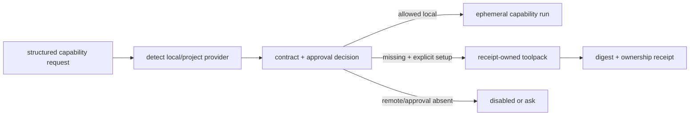

# Capabilities and approvals

LazyQoder is local-first. Its automatic broker selects the lightest eligible
capability for the task and keeps that selection task-scoped and nonpersistent.
It does not write target dependencies, lockfiles, host configuration, or a
host MCP registration. Model routing recommends a task class to Qoder's current
host-native selector, but the package does not reconfigure that selector. See
[the package model-routing guide](../lazyqoder-plugin/docs/model-routing.md)
for catalog, custom-model, cost, and host-observation boundaries.

## Capability ladder

| Need | Preferred provider | Fallback or boundary |
| --- | --- | --- |
| Local text search | `rg` / ripgrep | A pinned, receipt-owned fallback only when a compatible host provider is missing. |
| Structural search | `sg` / ast-grep | Local search. |
| JS/TS or Python navigation | LSP | Structural then local search; read-only operations only. |
| Architecture exploration | CodeGraph | Explicit lifecycle; code navigation then structural search. |
| Current library documentation | Context7 | Explicit remote selection; web search fallback. |
| External code examples | `grep_app` | Explicit remote selection; web search fallback. |
| Browser automation | Playwright | Explicit approval required. |
| Filesystem reads | Filesystem capability | Read-only and project-scoped; local search fallback. |

The local foundation can use pinned ripgrep, ast-grep, and an LSP provider in a
private, receipt-owned tooling root. JavaScript/TypeScript uses
`typescript-language-server@5.3.0` with `typescript@5.9.3`; Python uses
`basedpyright@1.39.9`. The LSP bridge offers only advertised read-only
operations such as definitions, references, symbols, hover/type information,
and diagnostics—never rename.

## Inspect before changing anything

```bash
# Reads the existing policy state; it does not create or update it.
bash scripts/lazyqoder-tooling.sh providers --policy ask-once --json
bash scripts/lazyqoder-tooling.sh detect --tooling-root /absolute/lazyqoder-tools
```

`providers` and `detect` are read-only inspection commands. Do not use
`setup --non-interactive --json` merely to inspect: when the policy file is
absent, `setup` initializes and writes it. A fallback install needs a
caller-selected, absolute, empty, non-symlink tooling root. It never targets
the repository, global paths, or host-managed paths. The receipt permits later
removal only when the root is still exactly owned and unmodified.

If policy inspection reports `AUTOMATIC_TOOLING_UNKNOWN_SCHEMA` or another
policy-state error, stop. Treat the policy state as malformed, unsupported, or
stale; inspect the existing file and report the error before any corrective
action. Do not run `setup`, overwrite the file, or assume that a missing
provider report means approval or configuration succeeded. An approval entry
whose contract digest no longer matches is not reused and resolves to `ask`.

## Approval boundaries

The default permission is deny. Local reads are allowed only within the
workspace; filesystem access is read-only and project-scoped. Network, browser
automation, costs, credentials/authentication, and writes need explicit
provider selection or an approval decision. Record persistent consent only with
an explicit workspace, capability, provider, and scope:

```bash
bash scripts/lazyqoder-tooling.sh approval grant \
  --workspace /absolute/project --capability ID --provider ID \
  --scope workspace --json
```

Use `deny`, `revoke`, or `check` with the same explicit identifiers as needed.
Provider reports identify cost, reachability, credential-reference state, and
the current decision. Credentials are references, not raw values in project
state.

## Remote providers and browser work

Context7 and experimental, unpinned `grep_app` are disabled by default.
`remote-enable` records a selected provider only in the receipt-owned tooling
root; `remote-export-mcp` prints a namespaced merge fragment for the host UI.
Neither edits host configuration, replaces host entries, nor emits credentials.
Treat every remote request as potential data egress and cost.

Playwright is not one of the six bundled local MCP declarations and requires
browser approval before automation. A host-governed web tool also follows the
host's network policy.

## CodeGraph is deliberately separate

CodeGraph is a local architecture capability, pinned to
`@colbymchenry/codegraph@1.4.1`. It is disabled by default; the broker does not
create an index, start a process, register MCP, or enable telemetry. Use the
explicit `codegraph-doctor`, `codegraph-install`, `codegraph-init`, and
`codegraph-enable` lifecycle only after choosing the project and tooling roots.
It is recommended at 500 supported source files or 100,000 supported source
lines. `context-graph` remains a grep-based heuristic fallback, not semantic
CodeGraph analysis.

Read [safe removal](08-safe-removal.md) before uninstalling any tooling, and
see [receipts and owned tooling](06b-receipts-and-owned-tooling.md) for the
ownership boundary. The fixed-registry docs MCP and structured secret-path
policy are described in [security and authority](06a-security-and-authority.md).

## Capability decision pipeline

The tooling implementation separates discovery, policy, execution, and ownership so a missing executable cannot silently become an install request:



`lazyqoder_capability.py` selects providers through `installed_provider`, `local_provider`, and `lsp_provider`; `sanitized_query` constrains query input before remote dispatch. `lazyqoder_policy.py:approval_decision` resolves the policy using the workspace, capability, provider, requested policy, and contract digest. A changed digest invalidates a stored decision rather than reusing consent for a different contract.

`lazyqoder_capability_receipt.py:prepare_toolpack` requires an explicit safe directory and prepares a temporary/owned pair. `write_receipt` stores a digest and installed-provider status. The receipt is later checked before removal; the provider code does not infer ownership from a convenient directory name.
