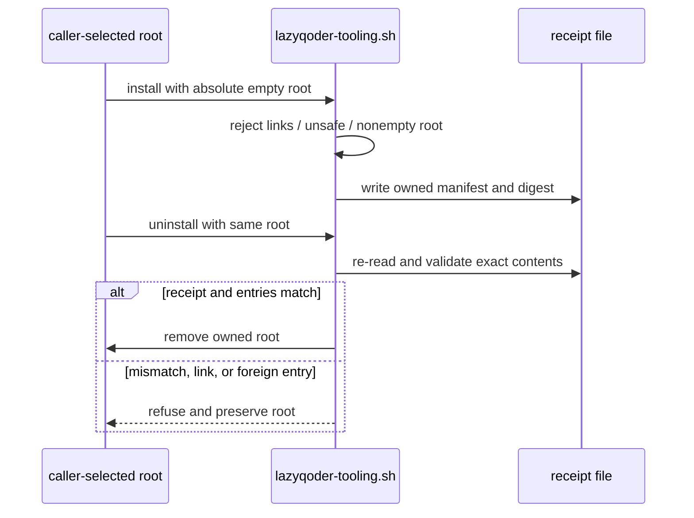

# Receipts and owned tooling

A receipt is proof of exactly what LazyQoder created in a caller-selected
tooling root. It is not a broad deletion permit, a host-registration receipt,
or evidence that a host loaded a plugin.

## Ownership before removal

Optional tooling can be installed only in an explicit absolute, empty,
non-symlink root. Its receipt records the owned contents and contract. Removal
checks that same exact ownership before deleting anything. Modified, foreign,
linked, caller-owned, project, global, and host-managed paths are retained.

```bash
bash scripts/lazyqoder-tooling.sh uninstall \
  --tooling-root /absolute/path/to/lazyqoder-tools
```

The command does not scan by name and does not remove credentials, host state,
host MCP entries, `.qoder` state, or an installation managed by a
marketplace. Read [safe removal](08-safe-removal.md) before invoking it.

## Receipts during work

Work evidence should record the requested result, changed files, commands and
results, real-surface observation where required, cleanup, and remaining risk.
`qoder-start-work` uses structured state and events so an independent verifier
can reproduce a DoneClaim rather than accept it on assertion. The state layout
is described in [state artifact reference](reference/state-artifact-reference.md).

## Separate package and host receipts

Package readiness can establish that scripts, manifests, declarations, and
local contracts exist. A host observation establishes only what was observed
in that host session. Neither substitutes for the other. Qoder IDE's local
fallback imports skills and requires manually configured compatible connectors;
it has no receipt that automatically installs a Qoder IDE plugin.

Next, read [state and validation](07a-state-and-validation.md) or the
[verification contract](reference/verification-contract.md).

## Receipt verification sequence

The tooling script treats installation and removal as inverse operations, not
as two directory commands:



In `lazyqoder-tooling.sh`, `root_is_safe_existing`, `root_is_empty`,
`receipt_contents`, `root_contains_only_owned_entries`, and
`owned_root_is_valid` form that validation chain. The same pattern is applied
to LSP and CodeGraph roots with separate receipts because they may have
different binaries and lifecycle state. A CodeGraph project index is not a
toolpack receipt entry, so it remains caller-owned.
