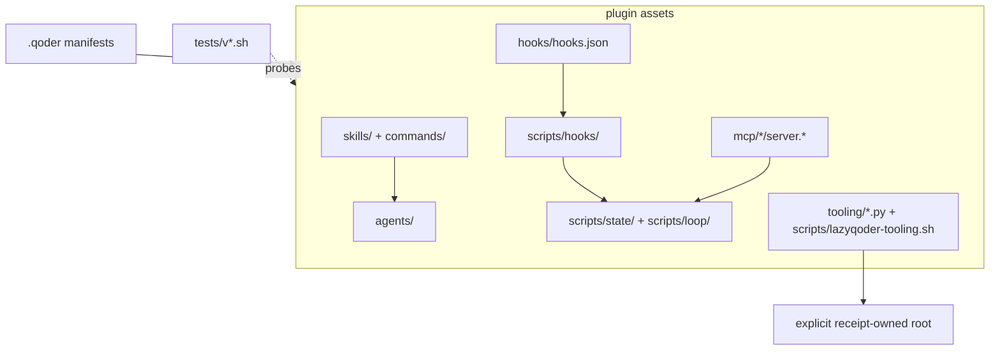

# Package map

`lazyqoder-plugin/` is the only runtime package. Its directory layout mirrors the way a host sees the harness: declarative workflow text, event adapters, local executable services, and verification.

## Roles and events

`skills/` and `commands/` are prompt-facing policy. Each describes a bounded workflow and its expected evidence. `agents/` provides focused roles such as planning, implementation, verification, QA, security, and context gathering. These files have no process authority by themselves; they are loaded only if the host accepts the package.

`hooks/hooks.json` declares which host event may call a script. The scripts under `scripts/hooks/` read structured input, apply narrow local policy, and avoid treating untrusted text as a shell command. Their output is host advice or local evidence, not proof that the host enforced the result.

## Local MCP inventory

The eight declarations in `.mcp.json` launch package-local services:

| Server | Source boundary | Purpose |
| --- | --- | --- |
| `run-ledger` | shell launcher + state scripts | Read/write durable workflow records. |
| `verification` | shell launcher + verifier | Report bounded package checks. |
| `status-dashboard` | launcher + static dashboard | Display package/run status. |
| `context-graph` | Python heuristic | Local grep-based relationships, not semantic CodeGraph. |
| `code-intel` | Python service | Local code-oriented helpers. |
| `docs` | Python registry client | Fixed-registry documentation lookup with SSRF boundaries. |
| `codegraph` | Python optional service | Architecture exploration; explicit install/init/enable only. |
| `lsp` | Python read-only bridge | Read-only JS/TS + Python LSP over stdio. |

Each declaration is a recipe for a host. It becomes a service only when the host starts it over stdio, under Qoder IDE **Agent-mode MCP**. [07b — MCP lifecycle](07b-mcp-lifecycle.md) follows that boundary in detail.

## Trace one request through the code

1. A user request selects a skill/command and, where applicable, a role definition.
2. Host tool activity can produce a structured hook event. `pre-tool-use.sh` and `post-tool-use.sh` inspect supported fields, while the package avoids granting authority based on free-form text.
3. State helpers under `scripts/state/` create or update a run, plan, task, event, or checkpoint. Loop helpers use that state to choose the next bounded action.
4. `lazyqoder-verify.sh` runs package-owned checks through `lazyqoder-bounded-run.py`. Each check gets an owned process group, a deadline, JSON status/reason, and best-effort cleanup. This is not a security sandbox; untrusted commands need VM or container-backed isolation.
5. The tests invoke these boundaries from copied/isolated fixtures, so package readiness never relies on a sibling checkout or a live host.

## Source-level reading map

The following table is the shortest route from an observed behavior to the
function that implements it. Read the call sites before changing a helper: most
of the safety rules are composed across a launcher, a shared helper, and a
regression fixture.

| Question | Entry point | Implementation to follow | Invariant |
| --- | --- | --- | --- |
| What does package readiness inspect? | `scripts/lazyqoder-load-check.sh` | `reject_symlinked_path_components`, JSON loading, and inventory counters | A copied package is checked through the selected root; symlinked path components are rejected. |
| How is aggregate verification run? | `scripts/lazyqoder-verify.sh` | `run_check`, `run_hook_pipeline_check`, `run_regression_inventory` | Every classified package regression is either executed or explicitly release-only. |
| How is a timeout represented? | `scripts/lazyqoder-bounded-run.py` | `process_records`, `descendant_records`, `terminate_owned_group`, `main` | Result JSON records timeout and detectable escapes; cleanup is best-effort. |
| How are hook paths interpreted? | `scripts/hooks/pre-tool-use.sh` | `components`, `matches`, `dangerous_operand` | Supported structured fields are inspected without evaluating user text as shell syntax. |
| How is a local path constrained? | `mcp/path_boundary.py` | `resolve_repo_path` | A resolved path must remain below the supplied repository root. |
| How does a capability acquire a toolpack? | `tooling/lazyqoder_capability.py` | `absolute_directory`, `local_provider`, `lsp_provider`, `run` | Toolpacks use an explicit absolute directory; project and host tools are considered first. |

## Control-plane versus data-plane

LazyQoder has a useful internal split:

- The **control plane** is Markdown policy, manifests, command names, agent
  roles, capability configuration, and receipts. It decides what is allowed
  and how a host should invoke the package.
- The **data plane** is structured hook input, run files, evidence records,
  JSON-RPC messages, subprocess output, and local search results. It carries
  work through narrow adapters.

This distinction explains why a command definition cannot directly mutate a
project, and why an MCP request cannot authorize a provider: each needs an
operational implementation that rechecks its own input and ownership boundary.
