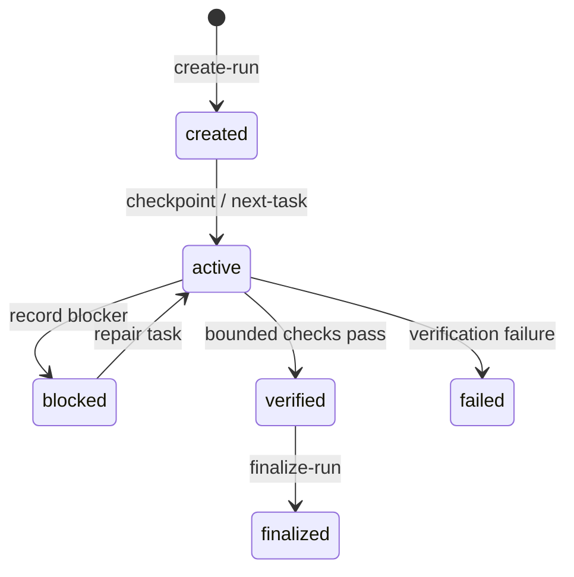

# State and validation

LazyQoder makes long-running work inspectable by writing explicit run artifacts instead of relying on conversation memory. State scripts own the transition rules; callers should not synthesize ledger files by hand.

## Run artifacts

The `scripts/state/` helpers create, locate, load, summarize, and validate the active run. `scripts/loop/` builds on that stable layout to classify a failure, create a repair task, select the next task, checkpoint progress, and finalize a completed run. Event append operations preserve a chronological record instead of rewriting a narrative summary.

The important invariant is that state is descriptive rather than authoritative over the host: a record can show that the package ran a check, but it cannot prove that Qoder IDE loaded a plugin or completed a host action.

## Validation is observable and bounded

`lazyqoder-verify.sh` is an aggregate dispatcher, not a sandbox. It invokes package-owned checks through `lazyqoder-bounded-run.py`, which starts each check in a separate process group and records status, reason, output tail, timeout information, and detectable escaped descendants.

On deadline the runner performs **best-effort** termination of its owned process group. It reports a detectable escape instead of promising descendant cleanup. This is **not a security sandbox**: verification commands are trusted package-owned code. A genuinely untrusted command belongs in a **VM or container-backed runner**, not this process-group mechanism.

## Read state at the correct boundary

`lazyqoder-load-check.sh` and doctor examine copied package inventory and contracts. The run ledger records package-local workflow activity. Neither means a host discovered the package, ran SessionStart, enforced a hook, or connected MCP. The required final fact for those claims is a host observation.

## Artifact lifecycle at field level

The state helpers divide work into small operations instead of one mutable
database API. `create-run.sh` establishes an initial run directory;
`load-run.sh` and `latest-run.sh` locate it; `append-event.sh` adds chronology;
`update-task.sh` and `update-plan-checkbox.sh` change the current work view;
`checkpoint.sh` records a resumable boundary; and `finalize-run.sh` creates the
terminal summary. `validate-state.sh` is the guardrail between these scripts
and malformed on-disk state.

This produces three useful properties:

1. **Replayability:** events and checkpoints reveal what the package recorded
   rather than only the latest status.
2. **Narrow mutation:** a task update does not need to rewrite verification
   output or unrelated evidence.
3. **Recoverability:** `recover-run.sh` and `summarize-run.sh` can work from
   durable artifacts after a session ends.

## Bounded-run result contract

`lazyqoder-bounded-run.py` writes one JSON object to the requested result file.
At minimum, callers use `status`, `reason`, and a bounded `tail`; timeout
handling adds process-group cleanup facts. `lazyqoder-verify.sh` consumes that
object in `record_check` and includes the per-check status/reason under its
aggregate `checks` member. A consumer should use the explicit reason rather
than infer success from a missing line of stderr.

The result contract intentionally distinguishes a check that failed, timed out,
was unavailable, or left detectable descendants. It does not promote cleanup
attempts into a claim that a hostile process tree was fully contained.
