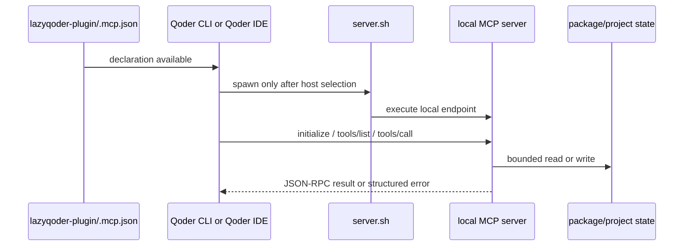

# MCP lifecycle

An MCP declaration is static configuration. A connected MCP tool is a running stdio process speaking JSON-RPC. LazyQoder documents and tests both layers without confusing either with host proof.

## The six local declarations

`.mcp.json` contains six package-local launcher entries: `run-ledger`, `verification`, `status-dashboard`, `context-graph`, `code-intel`, and `docs`. Their server scripts derive the package root from their own location rather than a sibling checkout. The docs endpoint accepts only validated package identifiers and fixed HTTPS registry endpoints; it does not follow package metadata homepages or arbitrary redirects.

`context-graph` is a local grep-based heuristic. It is intentionally not a semantic CodeGraph replacement. Filesystem and Playwright are not part of the base local inventory.

## Protocol boundary

Python helpers under `mcp/` use shared JSON-RPC and path-boundary logic. A server must emit protocol messages only on stdout, keep diagnostics on stderr, reject malformed requests with a structured JSON-RPC error, and keep reading later lines after a bad request. Regression fixtures exercise the malformed-stream behavior so one client mistake does not poison the next request.

## Host-specific route

The host decides whether and when to spawn a declaration. Package readiness can prove that launcher files and declarations exist; it cannot prove the host imported them, created a child process, or completed `initialize`. Host settings, credentials, connector state, and session lifetime remain host-owned. Optional CodeGraph and remote providers export explicit, user-merged fragments rather than silently registering persistent connectors.

## Request-processing contract

`mcp/jsonrpc.py` owns the generic line loop. `serve(handler)` reads stdin one
line at a time, parses JSON, validates the JSON-RPC envelope and identifier,
then calls a server-specific handler. Parse and envelope failures become
protocol errors on stdout, while implementation diagnostics stay on stderr.
The next line is still processed after an error.

Server-specific code may only interpret the request shape it documents. For
example, `mcp/path_boundary.py:resolve_repo_path` resolves a supplied path and
then verifies that its canonical form remains under the intended repository
root. The docs server treats an npm/PyPI package name as data, validates it,
and constructs a fixed registry request; it never treats a package homepage or
metadata URL as a destination.

## Why declarations are intentionally small

The launcher scripts do only package-root discovery and `exec` of their local
endpoint. They do not provision dependencies, register themselves with a host,
or write credentials. That small surface is what makes a copied package
testable: the declaration is static, process lifetime is host-owned, and each
server's mutable behavior remains behind a dedicated path/receipt boundary.

## Host enablement and connection

LazyQoder targets Qoder CLI, Qoder CLI, and Qoder IDE. Follow the selected
route in [Host routes](reference/host-routes.md). A valid declaration, marketplace
listing, or accepted trust prompt does not prove that a server connected. Verify
the expected MCP tools in the current host session before reporting host readiness.

Trae's project-level MCP toggle belongs to LazyTrae's installation flow; it is
not a LazyQoder setup step or a restriction to copy into Buddy validation.
