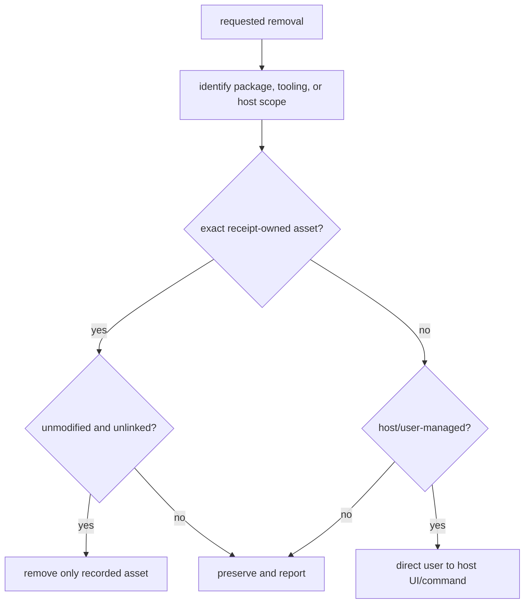

# Safe removal

Remove host-managed integration through its host, and remove package-owned
tooling only when its receipt proves ownership. These are separate operations.

## Remove by installation route

| Route | Safe action | Preserve |
| --- | --- | --- |
| Qoder IDE or Qoder CLI plugin | Use the host plugin removal flow; remove or disable only LazyQoder MCP servers that you manually registered. | Host installation paths, unrelated MCP entries, credentials, and host state. |
| Qoder app plugin/marketplace | Use the Qoder app's documented remove flow and confirm the result in the host. | Host-managed plugin locations and `.qoder` state. |
| Qoder app local-import fallback | Remove imported `skills/` entries through Skills UI and manually configured connectors through Settings. | Other imported skills, connectors, and Settings entries. |
| Receipt-owned tooling root | Run the package uninstall command only for the exact owned root. | Modified, foreign, linked, caller-owned, project, global, and host-managed paths. |

For a package-owned tooling root:

```bash
bash scripts/lazyqoder-tooling.sh uninstall \
  --tooling-root /absolute/path/to/lazyqoder-tools
```

The command removes only an unmodified, receipt-owned installation. It checks
for an exact ownership receipt and owned contents; it does not use a path name
as proof of ownership. If a root is modified, linked, foreign, or caller-owned,
it is preserved rather than removed.

## What not to remove

Never guess or scan for host-managed installation paths. Do not delete
`.qoder` state, `.qoder` compatibility metadata, another host's
MCP configuration, project files, global tools, or credentials. Removing a
tooling root does not authorize removal of a plugin, marketplace installation,
MCP registration, or credential state.

CodeGraph follows the same boundary. Its uninstall removes only a project
index proven by the CodeGraph receipt, and preserves a pre-existing
`.codegraph/` directory. Then the normal tooling-root uninstall may remove the
remaining verified root.

## Confirm the result

Report package removal separately from the user's observed host result. After
using a host removal UI, confirm that the plugin/skills and manually configured
connectors are gone in that host. Only then may the copied repository be
deleted; it is independent of host removal and is not itself a host installer.

Read [host routes](reference/host-routes.md) for the exact boundaries,
[MCP lifecycle](07b-mcp-lifecycle.md) for the host-registration sequence, and
[receipts and owned tooling](06b-receipts-and-owned-tooling.md) for receipt
ownership and optional tooling.

## Removal decision flow



The important implementation rule is that a refusal is a successful safety outcome. `lazyqoder-tooling.sh` validates an explicit root and receipt before deleting a toolpack; it never turns a filename match, parent directory, or host plugin name into ownership. Host removal remains a separate user action because the package cannot safely enumerate host-managed installation paths.
