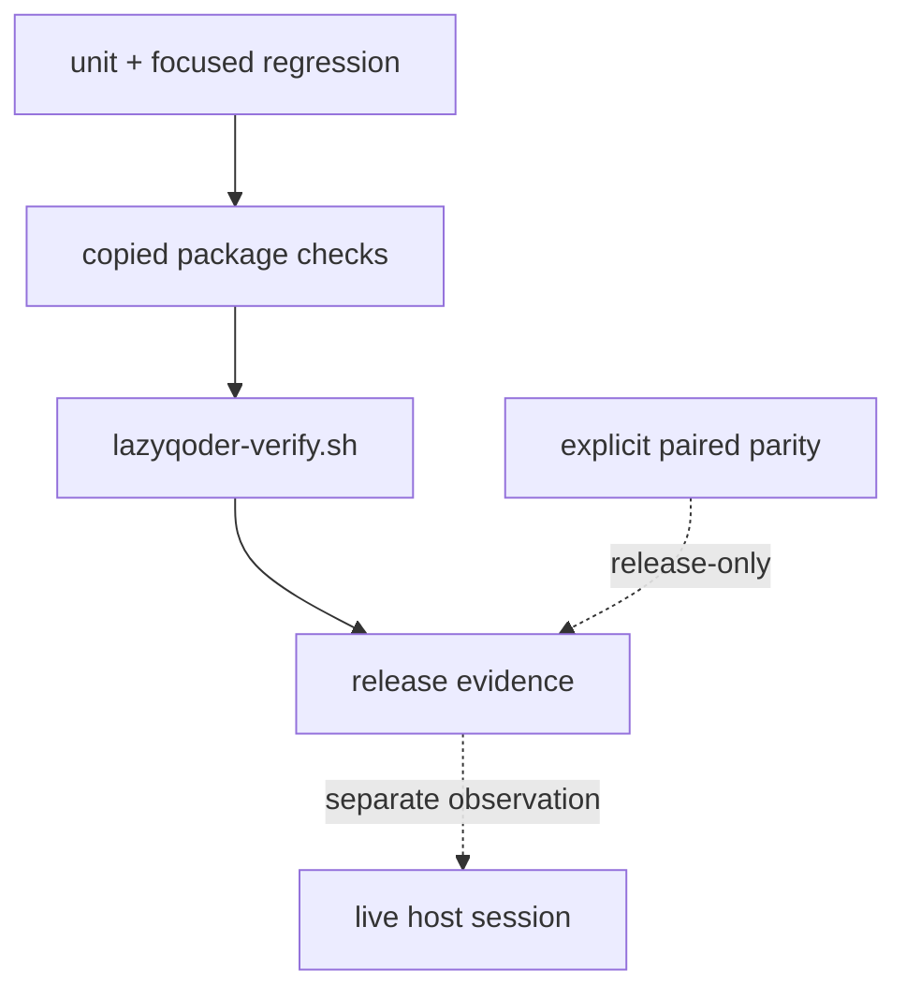

# Test and release verification

LazyQoder uses layered evidence. A release check is useful only when its scope is explicit: a syntax check does not prove a protocol, a protocol fixture does not prove a host connection, and host observation does not rewrite package ownership.

## Read the aggregate result

`scripts/lazyqoder-verify.sh` calls doctor, smoke, documentation, security, MCP, hook-pipeline, load-check, contract, and classified regression checks. It uses `lazyqoder-bounded-run.py` for package-owned checks so the JSON result contains a status and reason instead of a bare exit code. A timeout or failed check is a failure; an unavailable host-side validator is reported as an unchecked condition rather than a fabricated host success.

The verifier's timeout cleanup is **best-effort** process-group cleanup. It is **not a security sandbox** and does not guarantee descendant cleanup. Tests that need to execute untrusted input need a **VM or container-backed runner**.

## Regression families

The `tests/v*.sh` inventory covers copied-package boundaries, manifest and readiness structure, hook inputs, path policy, MCP protocol handling, tooling receipts, provider lifecycle, CodeGraph cleanup, and security regressions such as documentation-MCP SSRF and secret-target handling. Tests construct temporary fixtures so a pass means the package can stand alone rather than relying on the repository's current checkout.

## Release boundary

Normal CI is self-contained: it does not require a sibling repository. Documentation and contract parity with LazyTrae are release-only paired parity checks, run only when both absolute roots are explicitly supplied. That keeps the shared safety contract auditable without creating a runtime, installer, or CI dependency between packages.

The final host layer is intentionally manual. A Qoder IDE session must show the selected plugin surface, hook behavior where relevant, and MCP connection before those facts are claimed. Current package evidence is verified on macOS only.

## How to read a regression by boundary

The shell regressions are intentionally named by the boundary they attack, not
by an implementation detail. For example:

| Regression family | Fixture/action | Failure it prevents |
| --- | --- | --- |
| package/readiness | copied package root and manifest checks | Source checkout assumptions or missing shipped assets. |
| hook/security | structured tool payloads and secret-like paths | Treating arbitrary text as a write target or command authority. |
| MCP params/SSRF | malformed JSON-RPC and attacker-controlled metadata | Stream poisoning or registry metadata becoming a network target. |
| tooling/receipt | empty, linked, modified, and foreign roots | A lifecycle command deleting data it did not create. |
| bounded verifier | timeout and process fixtures | Reporting timeout as success or claiming guaranteed cleanup. |

When a regression fails, start from its fixture and expected assertion, then
follow the smallest source function named in the failure. Do not “fix” a
release check by weakening its assertion: each assertion encodes a published
ownership or evidence contract.
