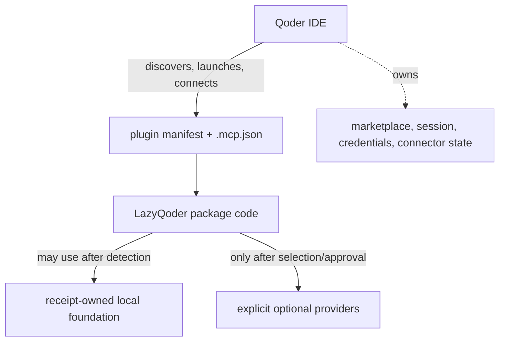

# Dependency and host boundary reference

This page answers a common source-reading question: which behavior is supplied by LazyQoder itself, which behavior is borrowed from a local dependency, and which behavior belongs entirely to Qoder IDE?

## Four dependency classes

| Class | Examples | Who supplies it | When it runs | What LazyQoder can claim |
| --- | --- | --- | --- | --- |
| Package implementation | Shell/Python scripts, skills, commands, agents, hook mappings | LazyQoder package | Host invocation or a local script run | The files and local behavior are present and tested. |
| Host runtime | Plugin discovery, slash commands, event delivery, MCP launch, marketplace | Qoder IDE | Only inside the selected host/session | Nothing until the user observes it. |
| Local foundation | `rg`, `sg`, JS/TS or Python LSP fallback | Existing machine tool or receipt-owned toolpack | Task-scoped local work | A provider is available within its defined root. |
| Optional/remote provider | CodeGraph, Context7, `grep_app`, filesystem, Playwright | Explicit provider lifecycle and host | Only after selection/approval | Selected configuration or receipt state, never connection. |

## What LazyQoder implements directly

The package implements workflow policy files, run-state scripts, receipt verification, package readiness/doctor/aggregate checks, path boundaries, structured hook policy, and eight local MCP programs. The local MCP programs use Bash/Python and package-local launchers; they do not need a LazyCodex/OmO runtime. `context-graph` is a local grep-based heuristic, so its results are approximate rather than semantic CodeGraph analysis.

The tooling manifest pins fallback packages for ripgrep, ast-grep, and CodeGraph. These are not permanent project dependencies: existing compatible tools are checked first, and fallback installation is limited to a caller-selected receipt-owned root. LSP fallback packages are selected by supported workspace language. Target dependency manifests, lockfiles, and host configuration are outside this lifecycle.

## What remains a raw host capability

Qoder IDE owns plugin discovery, command exposure, hook-event delivery, MCP process launch, session lifetime, marketplace installation, credentials, and connection status. LazyQoder supplies manifests and launch recipes, but does not reimplement those services or inspect private host state to guess success.

The Qoder IDE local skill import is intentionally narrower: importing `skills/` can make skill text available, but does not prove that command definitions, agents, hooks, or `.mcp.json` were loaded. Each is a separate host capability requiring observation.

## Dependency decision sequence

1. The capability broker classifies a task and checks an existing local tool.
2. If compatible, it is used without a project mutation.
3. If the local foundation is missing and policy allows it, a pinned fallback is installed in an explicit empty receipt-owned root.
4. Architecture, remote, browser, filesystem, credential, cost, egress, and host-registration decisions remain explicit.
5. A host may launch a declared MCP only after its own configuration/session chooses to do so; connection is host evidence, not package evidence.

For endpoint details, see [MCP inventory](mcp-inventory.md). For the policy, see [Capabilities and approvals](../06-capabilities-and-approvals.md).
