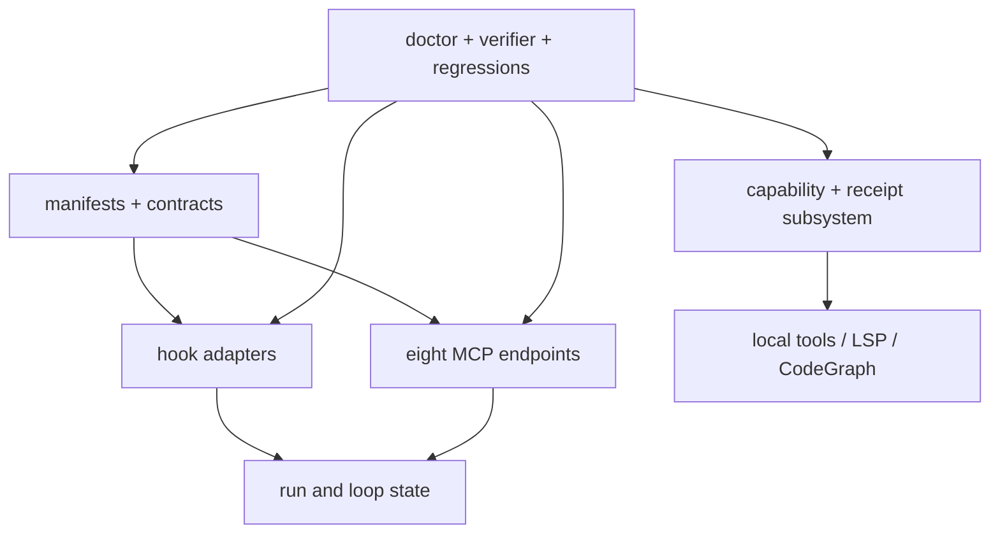

# Runtime subsystem reference

This source-index groups every LazyQoder runtime family by responsibility, including the smaller files that are easy to miss when reading only the main request path.

## Manifest, contract, and readiness layer

`.qoder/plugin.json` advertises skills, commands, agents, hooks, and `.mcp.json`; it does not load a host. `contracts/automatic-tooling-contract.v1.json` defines providers, fallbacks, permissions, timeouts, and error identifiers. `contracts/lazyseries-capability-readiness.v1.json` defines the canonical capability-readiness records (`lazyqoder_capability_readiness.py readiness-report --json` returns 9 records). Load-check, doctor, and contract checks validate these artifacts from a package root.

## Hook and event layer

`hooks/hooks.json` maps host events to `scripts/hooks/`. The family includes session/context start, user prompt, pre/post tool policy, compact handling, task/subagent lifecycle, stop gate/failure, and task completion. `pre-tool-use.sh` normalizes supported path fields and checks destructive/secret-target policy. `post-tool-use.sh` can record evidence-oriented consequences. Other hooks recover context or surface workflow status; none prove that a host delivered their event. `hook-pipeline-test.sh` tests controlled structured input.

## Run, loop, and evidence layer

`scripts/state/state-paths.sh` is the shared root/run-ID boundary. Its companion scripts create, load, list, validate, checkpoint, summarize, append events, update tasks/checkboxes, and recover runs. `scripts/loop/` classifies failure, creates repair tasks, selects work, runs a cycle, and finalizes a run. This is file-backed workflow state, not a database and not host session state.

## MCP and local analysis layer

The run-ledger, verification, and dashboard servers expose constrained state views. `mcp/jsonrpc.py` is the line protocol loop; `mcp/path_boundary.py` canonicalizes repository-local paths. `context-graph` uses `rg`/`grep` heuristics. `code-intel` and `lsp` are local code-oriented bridges; `mcp/lsp/session.py` manages LSP session protocol while operations remain read-only. `codegraph` is an optional, explicitly enabled architecture explorer. `docs` only queries fixed package registries.

## Tooling and process layer

`lazyqoder-tooling.sh` owns provider status, install, doctor, uninstall, native-check discovery, LSP, CodeGraph, and optional remote export. Python helpers split capability execution, contract validation, process invocation, readiness records, receipts, detection, and policy/configuration. `lazyqoder-bounded-run.py` reports timeouts and best-effort owned process-group cleanup for trusted checks.

## Verification layer

Smoke, security, MCP, hook-pipeline, doctor, load-check, contract, and documentation scripts each verify one boundary. `lazyqoder-verify.sh` aggregates them and classifies every `tests/v*.sh` regression. Paired docs parity is release-only with explicit sibling roots; normal verification remains self-contained.

Use [Package map](../07-package-map.md), [MCP inventory](mcp-inventory.md), and [Dependency and host boundary reference](dependency-and-host-boundaries.md) to continue the trace.
