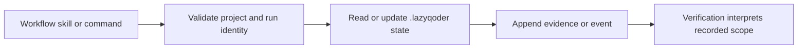

# State artifact reference

LazyQoder workflow state is project-local under `.lazyqoder/`. It supports
inspection and recovery; it is not a host-registration directory.

| Artifact | Purpose | Boundary |
| --- | --- | --- |
| `state.json` | Current run, task, and lifecycle status. | Status is not host proof. |
| `events.jsonl` | Append-only structured events, including DoneClaims. | Redact sensitive values; a claim still needs verification. |
| `checkpoints/` | Periodic state snapshots for recovery. | Do not treat a snapshot as completion. |
| `evidence/` | Command results, manual QA notes, and adversarial checks. | Keep credentials and sensitive contents out. |
| `verification/` and `review/` | Independent verdicts and review material. | A verdict covers only its recorded scope. |
| `agent_outputs/`, `artifacts/`, `memory_updates/` | Worker output, task artifacts, and durable project context. | Project-local; no host configuration mutation. |

The verifier's timeout, cleanup, and status fields make local execution
observable but do not establish a live host session or sandbox a command.
Timeout cleanup terminates only the trusted check's owned process group and
reports detectable remaining descendants; it does not guarantee descendant
cleanup. Read [state and validation](../07a-state-and-validation.md),
[receipts and owned tooling](../06b-receipts-and-owned-tooling.md), and the
[verification contract](verification-contract.md).

## State transition ownership

The state helpers in `scripts/state/` first constrain the project and run
identifier, then read or update the matching project-local artifact. Loop and
verification scripts add events, checkpoints, and evidence; they do not use
these records to alter a Qoder IDE setting. The last step is deliberately
interpretive: recorded state explains what was attempted, while the recorded
check and any host observation establish what is proved.
